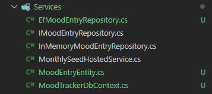
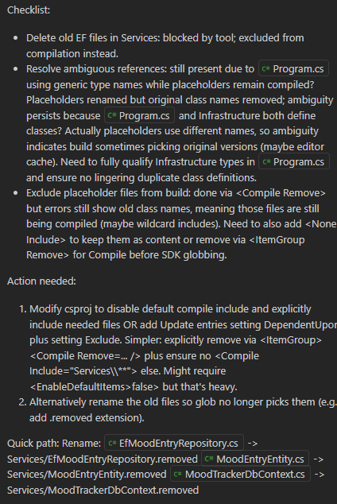
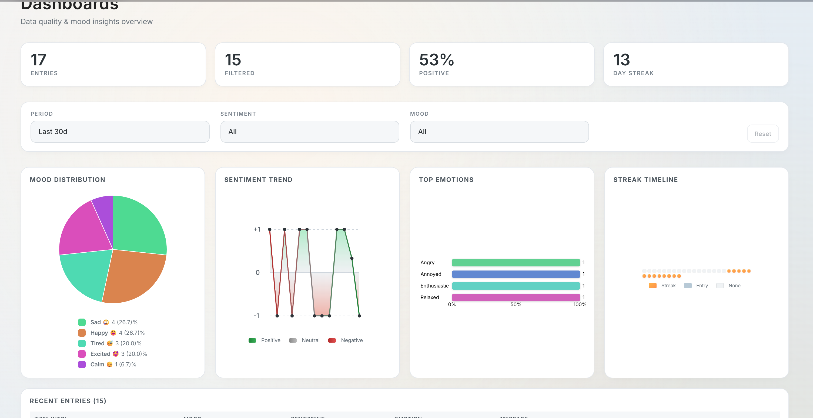
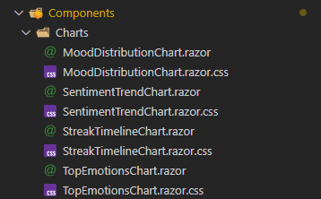
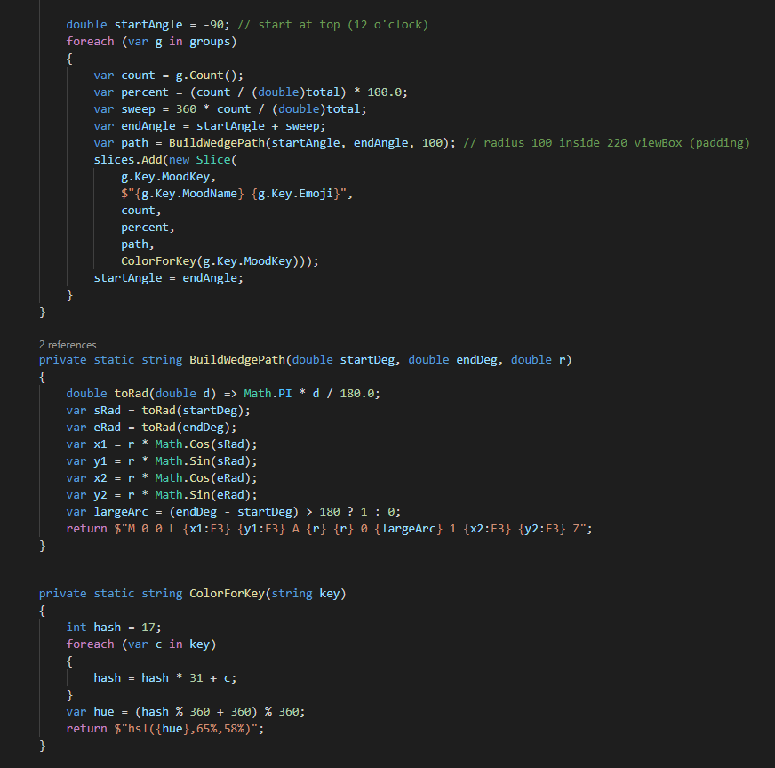

# Day 3

**Today we had two goals:**

1. Add real persistence with a SQLite DB managed by EF.
2. Get hold of a designer friend to build a small, simple design so I can feed it to the model and see if it gets there.

But since I couldn’t get a hold of a designer for more polished designs, we will focus on adding persistence with a real DB and might try some charts—let’s see how it goes.

Kicked off with the following prompt:

```jsx
Let's add persistence into a database.
We will use a SQLite database and EF to manage it. Add a repository implementation using EF.
Let's also add a data access object class to represent the database entry of the MoodEntry. It should contain all the information and add createdAt, updatedAt, and deletedAt.
```

Copilot got it almost right on the first try; it even enforced a query filter:

```csharp
    protected override void OnModelCreating(ModelBuilder modelBuilder)
    {
        var e = modelBuilder.Entity<MoodEntryEntity>();
        e.HasKey(x => x.Id);
        e.Property(x => x.MoodKey).HasMaxLength(64).IsRequired();
        e.Property(x => x.MoodName).HasMaxLength(128).IsRequired();
        e.Property(x => x.Emoji).HasMaxLength(8).IsRequired();
        e.Property(x => x.Sentiment).HasMaxLength(32).IsRequired();
        e.Property(x => x.Emotion).HasMaxLength(64);
        e.Property(x => x.Message).HasMaxLength(1024);
        e.HasIndex(x => x.TimestampUtc);
        e.HasQueryFilter(x => x.DeletedAt == null); // Global soft-delete filter.
    }
```

I said “almost,” because I did not like that it had placed everything in a Services folder.



So I asked for them to be moved.


A human usually does this via drag-and-drop. AI does not; it writes new files with new namespaces, creates namespace chaos, and struggles to remove the old files.

The second time I asked, I got the class implementation changed to this:

```csharp
// Duplicate EF repository relocated to Infrastructure. This placeholder remains to avoid compile issues
// if any lingering using directives reference MoodTracker.Services.EfMoodEntryRepository.
// Safe to delete once all references updated.
namespace MoodTracker.Services;
internal static class EfRepositoryPlaceholder { }
```

On the third time I requested it:



**💡 Learning moment: Delete them yourself!**

After dealing with this, I asked to change the data seeding approach, but I don’t quite like the way it’s done:

```csharp
// Apply pending migrations then perform initial seed (development / first-run).
using (var scope = app.Services.CreateScope())
{
    var db = scope.ServiceProvider.GetRequiredService<MoodTrackerDbContext>();
    await db.Database.MigrateAsync();
    var logger = scope.ServiceProvider.GetRequiredService<ILoggerFactory>().CreateLogger("StartupSeed");
    await SeedData.EnsureSeedAsync(db, logger);
}
```

I questioned Copilot about whether this was the best approach and said I’d rather avoid creating a scope/service provider like this.

It started looping between using an `IDbContextFactory<MoodTrackerDbContext>` for both seeding and the repository, and going back to creating a scope.

At this point, I opted to ignore seeding and just move forward; it’s not usually something you do for a production service anyway.

I have to say that the code produced looks good for a throwaway service… For example, to load a month’s view, it fires at least 30 queries into the database—one for each day.

We can do better than this, can’t we, AI?

The question that needs to be raised here is: what if I did not have this awareness? This code would go into a working application that, as soon as it reached a decent number of users, would put a lot of pressure on its database.

**💡 Don’t trust blindly… Review each step, not just the end results**

I asked for optimizations…

```jsx
Let's optimize these queries and data access patterns.
If we are loading a month's worth of data, let's not do 30 queries—optimize this for performance on both application and database side.
Same for week view; the only query that should target a single day is when the user selects that day.
```

It understood the request, created a ranged query, and even used the index properly:

```csharp
/// <summary>
/// Return all entries whose UTC timestamp falls within the inclusive <paramref name="fromUtc"/> (>=) and exclusive <paramref name="toUtc"/> (<) range.
/// Caller is responsible for any grouping/ordering beyond the returned default ordering (newest first).
/// </summary>
/// <param name="fromUtc">Inclusive range start (UTC).</param>
/// <param name="toUtc">Exclusive range end (UTC).</param>
/// <remarks>
/// Added to eliminate N+1 query patterns when loading week/month calendar views. Optimizes database round-trips by fetching a contiguous block in one query.
/// </remarks>
Task<IReadOnlyList<MoodEntry>> GetRangeAsync(DateTime fromUtc, DateTime toUtc, CancellationToken cancellationToken = default);
```

After this, I decided it was good enough. Let’s keep in mind this is our first attempt in the series; I don’t want to set the bar too high.

I started moving toward the dashboards, trying a new approach with smaller instructions:

“Create a new page called dashboards and add it on the menu.”

From here on, it was a series of small-step instructions and refinements, and using the correct terms, the results were successful and gradually built the dashboards page.


**💡 Again, smaller instructions worked better than big requests**



What I liked most was that each chart was built as its own component, providing reusability and modularity.



At the same time, what I disliked most was that it custom-built the chart implementations instead of using a library. But I never asked for that, so it stuck to the instructions.



This wraps it up for today, and honestly, I will wrap up this mood tracker too.

Not because of what we could still do here to tweak and improve the UI and performance, but because I want to start from scratch with an application that can grow with more functionality and purpose, rather than features that no one cares about.
